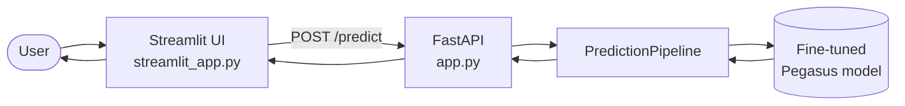
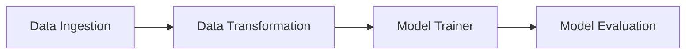

<div align="center">

# 📝 Text Summarization with Pegasus

**An end-to-end NLP project: fine-tune a Pegasus transformer, serve it with FastAPI, and use it through a modern Streamlit interface.**

[](https://text-summarization-edw7makqgxqte9bgozvakk.streamlit.app/)
[](https://www.python.org/)
[](https://fastapi.tiangolo.com/)
[](https://huggingface.co/google/pegasus-cnn_dailymail)
[](#-run-with-docker)
[](LICENSE)

### 🚀 [Try the live demo](https://text-summarization-edw7makqgxqte9bgozvakk.streamlit.app/)

</div>

---

## 📚 Table of Contents

- [Overview](#-overview)
- [Features](#-features)
- [Architecture](#-architecture)
- [Tech Stack](#-tech-stack)
- [Project Structure](#-project-structure)
- [Getting Started](#-getting-started)
- [Usage](#-usage)
- [Training Pipeline](#-training-pipeline)
- [Run with Docker](#-run-with-docker)
- [Configuration](#%EF%B8%8F-configuration)
- [Troubleshooting](#-troubleshooting)
- [Limitations](#-limitations)
- [Roadmap](#-roadmap)
- [Acknowledgements](#-acknowledgements)
- [License](#-license)
- [Author](#-author)

---

## 🔎 Overview

This project turns long English text into short, readable summaries. It covers the full machine-learning lifecycle:

1. **Train** – fine-tune [`google/pegasus-cnn_dailymail`](https://huggingface.co/google/pegasus-cnn_dailymail) with Hugging Face Transformers through a modular, config-driven pipeline.
2. **Serve** – expose the trained model through a **FastAPI** REST API.
3. **Use** – summarize text from a polished **Streamlit** web app that talks to the API.

The code follows a clean component / pipeline / configuration-manager layout, so every stage can be changed from YAML files without touching the core logic.

---

## ✨ Features

**Model and API**

- Fine-tuned Pegasus abstractive summarizer
- FastAPI service with interactive Swagger docs (`/docs`) and a `/health` endpoint
- Model is loaded once at start-up, not per request
- Config-driven training pipeline (`config.yaml` and `params.yaml`)
- Dockerfile and GitHub Actions workflow folder included

**Web interface**

- **Long-text support**: texts of any length are split into sentence-aligned chunks, summarized, and merged
- **Summary detail**: *Standard* or *Concise* (merges the part summaries into one short summary)
- **Output format**: paragraph or bullet points
- **File upload**: TXT, MD, PDF and DOCX
- **Key-term highlighting** inside the summary, plus key-term chips
- **Quality stats**: reduction %, reading time saved, Flesch readability (before → after), processing time
- **Listen** to the summary (browser text-to-speech), **copy** it, or **download** it as `.txt` / `.md`
- **Dark and light mode** with an animated circular-reveal transition (state is kept in the URL, e.g. `?theme=light`)
- Session **history**, live **API status** badge, and a warning when the text is not English
- Keyboard shortcut: `Ctrl + Enter` to summarize

---

## 🏗 Architecture



For texts longer than the model's input window, the UI splits the text into chunks of about 350 words, calls the API once per chunk, and combines the results.

---

## 🧰 Tech Stack

| Layer | Tools |
|---|---|
| Model | Pegasus (`google/pegasus-cnn_dailymail`), Hugging Face Transformers, PyTorch |
| Backend | FastAPI, Uvicorn |
| Frontend | Streamlit, custom CSS and JavaScript |
| Config and packaging | YAML, `setup.py`, `template.py` |
| DevOps | Docker, GitHub Actions |

---

## 🗂 Project Structure

```text
Text-Summarization/
├── .github/workflows/      # CI/CD workflow
├── .streamlit/             # Streamlit theme config
├── config/                 # config.yaml (paths and artifacts)
├── research/               # Experiments and notebooks
├── src/text_summarizer/    # Main package
│   ├── components/         # Data ingestion, transformation, training, evaluation
│   ├── config/             # Configuration manager
│   ├── entity/             # Config dataclasses
│   ├── pipeline/           # Training and prediction pipelines
│   ├── logging/            # Logger setup
│   ├── utils/              # Helper functions
│   └── constants/          # Project constants
├── app.py                  # FastAPI backend
├── streamlit_app.py        # Streamlit frontend
├── main.py                 # Runs the training pipeline
├── params.yaml             # Training hyper-parameters
├── template.py             # Project scaffolding script
├── setup.py
├── Dockerfile
├── requirements.txt
└── LICENSE
```

---

## 🚀 Getting Started

### Prerequisites

- Python **3.11**
- [Conda](https://docs.conda.io/) (recommended) or `venv`
- A trained model available to `PredictionPipeline` (see [Training Pipeline](#-training-pipeline))

### 1. Clone the repository

```bash
git clone https://github.com/engSalah-dot/Text-Summarization.git
cd Text-Summarization
```

### 2. Create an environment

```bash
conda create -n summary python=3.11 -y
conda activate summary
```

### 3. Install dependencies

```bash
pip install -r requirements.txt
```

### 4. Start the backend (terminal 1)

```bash
python app.py
```

The API is now available at `http://127.0.0.1:8000` and the Swagger docs at `http://127.0.0.1:8000/docs`.

### 5. Start the web app (terminal 2)

```bash
streamlit run streamlit_app.py
```

Open the URL printed in the terminal (usually `http://localhost:8501`).

---

## 💡 Usage

### Web app

1. Paste text, click **Try a sample**, or upload a file.
2. Choose **Standard** or **Concise**.
3. Click **Summarize** (or press `Ctrl + Enter`).
4. Switch between paragraph and bullets, highlight key terms, listen, copy, or download the result.

### REST API

| Method | Endpoint | Description |
|---|---|---|
| `GET` | `/` | Redirects to the Swagger docs |
| `GET` | `/health` | Health check and model status |
| `POST` | `/predict?text=...` | Returns a summary of the given text |

```bash
curl -X POST "http://127.0.0.1:8000/predict?text=The%20James%20Webb%20Space%20Telescope%20is%20the%20largest%20space%20telescope%20ever%20built."
```

Example response:

```json
{
  "summary": "The James Webb Space Telescope observes the universe in infrared light and has revealed new details about early galaxies."
}
```

### Python

```python
import requests

response = requests.post(
    "http://127.0.0.1:8000/predict",
    params={"text": "Your long English text here..."},
    timeout=180,
)
print(response.json()["summary"])
```

---

## 🧪 Training Pipeline

The pipeline is modular and every stage reads its settings from YAML:



Run the full pipeline:

```bash
python main.py
```

**Base model:** `google/pegasus-cnn_dailymail`

**Hyper-parameters** (`params.yaml`):

| Parameter | Value |
|---|---|
| `num_train_epochs` | 1 |
| `warmup_steps` | 500 |
| `per_device_train_batch_size` | 1 |
| `gradient_accumulation_steps` | 16 |
| `weight_decay` | 0.01 |
| `logging_steps` | 10 |
| `eval_steps` | 50 |
| `save_steps` | 1000000 |

### Development workflow

When adding or changing a pipeline stage, follow this order:

1. Update `config/config.yaml`
2. Update `params.yaml`
3. Update the entity (`src/text_summarizer/entity`)
4. Update the configuration manager (`src/text_summarizer/config`)
5. Update the components (`src/text_summarizer/components`)
6. Update the pipeline (`src/text_summarizer/pipeline`)
7. Update `main.py`
8. Update `app.py`

---

## 🐳 Run with Docker

```bash
docker build -t text-summarizer .
docker run -p 8000:8000 text-summarizer
```

If your `app.py` listens on a different port, change the `-p host:container` mapping to match.

---

## ⚙️ Configuration

| File | Purpose |
|---|---|
| `config/config.yaml` | Paths and artifact locations for each pipeline stage |
| `params.yaml` | Training hyper-parameters |
| `.streamlit/config.toml` | Streamlit base theme |
| `streamlit_app.py` → `API_BASE` | Backend URL used by the web app (default `http://127.0.0.1:8000`) |
| `streamlit_app.py` → `CHUNK_WORDS`, `MAX_WORDS` | Chunk size and maximum input length |

---

## 🩹 Troubleshooting

| Problem | Fix |
|---|---|
| UI shows **API offline** | Start the backend with `python app.py` and check that `API_BASE` points to it |
| `404` on `/predict` | Make sure `app.py` defines the `POST /predict` route |
| `Cannot reach the API` | The backend is not running, or the port or URL is wrong |
| Very slow first request | The model is loading or running on CPU; later requests are faster |
| Poor summary for non-English text | The model is trained for English only |

---

## ⚠️ Limitations

- **English only**: the model is trained and evaluated on English text.
- **Abstractive model**: summaries can occasionally contain inaccuracies, so check important facts against the source.
- **Speed**: inference on CPU is slower than on GPU, especially for long documents.

---

## 🗺 Roadmap

- [ ] Add ROUGE scores and example outputs to this README
- [ ] Selectable summary length (short / medium / long) in the API
- [ ] Multilingual support
- [ ] Automated tests and CI checks
- [ ] Deploy the API as a separate hosted service

---

## 🙏 Acknowledgements

- [Hugging Face Transformers](https://github.com/huggingface/transformers) and the [Pegasus](https://arxiv.org/abs/1912.08777) authors
- The project structure is based on the *End-to-end Text Summarization* template by [entbappy](https://github.com/entbappy/End-to-end-Text-Summarization)
- [FastAPI](https://fastapi.tiangolo.com/) and [Streamlit](https://streamlit.io/)

---

## 📄 License

This project is licensed under the **MIT License**. See the [LICENSE](LICENSE) file for details.

---

## 👤 Author

**Salah** ([@engSalah-dot](https://github.com/engSalah-dot)), Data & AI Engineer

📧 [amirebied886@gmail.com](mailto:amirebied886@gmail.com)

<div align="center">

⭐ If you found this project useful, please consider giving it a star.

</div>

